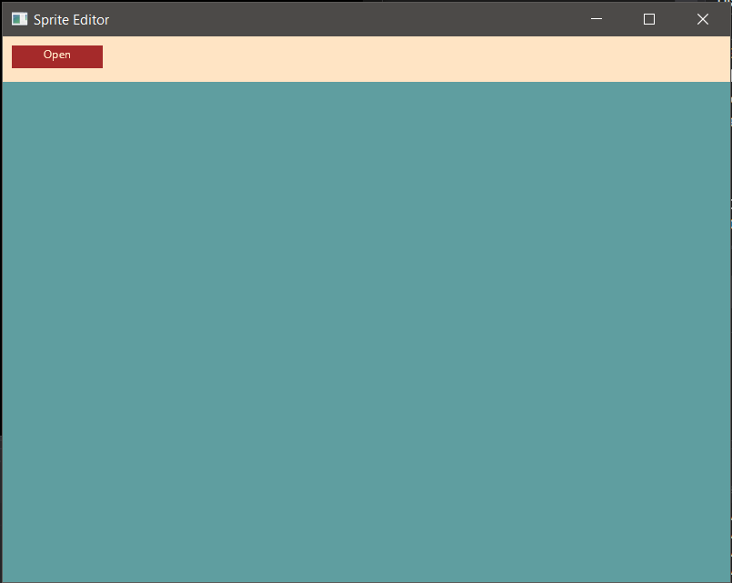
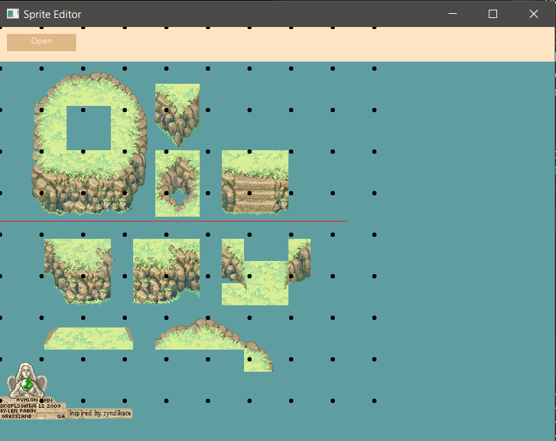

# SkiaCore - Cross-Platform SkiaSharp Renderer on .Net Core


SkiaCore is a library that uses OpenGL to render graphics powered by the Skia engine. It is currently set-up for Windows but will be expanded further in the future to support multiple platforms. The project uses Facebook's Yoga layout engine to enable styling in a convenient CSS style pattern.

<b>Note: This library is currently in Alpha. </b>

## Getting Started

It's quite easy to get started with SkiaCore. First reference the project into your main project, and then initialize:

```
using SkiaCore;

//This is required and should be the first call before using the library
Core.Initialize(800, 600, "Sprite Editor");
```

Now you can add custom components in such a fashion:
```
Core.AddRenderComponent(new TestComponent(50, 50, "#ff0000"));
Core.AddRenderComponent(new TestComponent(50, 50, "#ff0f00"), item);
```

The components will not show up correctly until you recalculate the tree via the Recalculate method.
```
Core.Recalculate();
```

## Components

Components are the building blocks of SkiaSharp. You can implement the abstract class 'Component' from SkiaCore.Components to start building your own. Here's an example of TestComponent
from the example above:

```
class TestComponent : Component
{
    public TestComponent(int width, int height, params object[] args) : base(width, height, args)
    {
        this.SetColor(SKColor.Parse((string)args[0]));
    }
}
```

If you would like click functionality, you can implement from 'InteractableComponent' which provides override methods OnClick(), OnMouseEnter(), and OnMouseExit(). Heres an example
of a Button that implements this class and uses P/Invoke to open a Windows dialog to load a file:

```
using System;
using SkiaSharp;
using SkiaCore.Components;
using System.Runtime.InteropServices;

namespace SpriteEditor.Components
{
    public class Button : InteractableComponent
    {
        string _text;
        SKColor _inColor = SKColors.Brown;
        SKColor _outColor = SKColors.BurlyWood;
        SKColor _color;

        [StructLayout(LayoutKind.Sequential, CharSet = CharSet.Auto)]
        public struct OpenFileName
        {
            public int lStructSize;
            public IntPtr hwndOwner;
            public IntPtr hInstance;
            public string lpstrFilter;
            public string lpstrCustomFilter;
            public int nMaxCustFilter;
            public int nFilterIndex;
            public string lpstrFile;
            public int nMaxFile;
            public string lpstrFileTitle;
            public int nMaxFileTitle;
            public string lpstrInitialDir;
            public string lpstrTitle;
            public int Flags;
            public short nFileOffset;
            public short nFileExtension;
            public string lpstrDefExt;
            public IntPtr lCustData;
            public IntPtr lpfnHook;
            public string lpTemplateName;
            public IntPtr pvReserved;
            public int dwReserved;
            public int flagsEx;
        }

        [DllImport("Comdlg32.dll", CharSet = CharSet.Auto, SetLastError = true)]
        private static extern bool GetOpenFileName(ref OpenFileName ofn);

        public Button(SKSurface surface, int x, int y, int width, int height, params object[] args) : base(surface, x, y, width, height, args)
        {
            _text = args[0].ToString();
            _color = _outColor;
        }

        override public void OnClick()
        {
            var ofn = new OpenFileName();
            ofn.lStructSize = Marshal.SizeOf(ofn);
            ofn.lpstrFilter = "All files(*.*)\0\0";
            ofn.lpstrFile = new string(new char[256]);
            ofn.nMaxFile = ofn.lpstrFile.Length;
            ofn.lpstrFileTitle = new string(new char[64]);
            ofn.nMaxFileTitle = ofn.lpstrFileTitle.Length;
            ofn.lpstrTitle = "Open File Dialog...";
            if (GetOpenFileName(ref ofn)) 
            {
                SpriteView.SetImage(ofn.lpstrFile);
            }
        }

        override public void OnMouseEnter()
        {
            _color = _inColor;
        }

        override public void OnMouseExit()
        {
            _color = _outColor;
        }
    }
}

```

### Random example of this quick UI:



## Dependencies
- Arqan (https://github.com/TheBoneJarmer/Arqan) - Included via NuGet package.
- Yoga (https://github.com/facebook/yoga) - pre-compiled (.NET 5.0) and available in the Libs directory.
- SkiaSharp - Included via NuGet
- Visual Studio 2019
